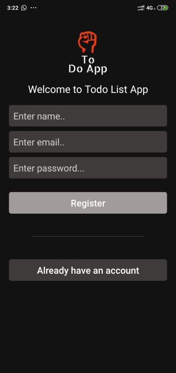
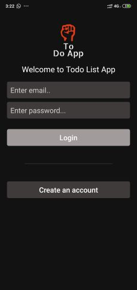

# ToDoApp With REST API


>In ToDO Application we use Rest Api as backend. This REST API is build in NodeJs,ExpressJs and Mongodb . IDE VISUAL STDIO CODE and the API tested on Postman

>For Android Application Development we use IDE ANDROID STDIO and java.


## Features Of Application

&rarr; ToDo App handles your daily routine. some times you forgot to do your works.

&rarr; Our App is very concern about your precious time. 

&rarr; And this app will definitely help you todo your works on very right time.

### Firstly you have to login or register to our app with right email and password.

 


# heading 1
## heading 2

_italics_

**strongs**

~~100000~~ **999**

links

[Visit website](https://learncodeonline.in "LCO")

Images


use `for` loop

``` javascript

var name = "saura";
console.log(name);

```
//
Tables
|Table|Goes|ere|
|----- |----- |----- |
| one  | two  | three |

>keep ssmilling and work harder

1. list one 
2. list two
1. list three
4. List four
   
- List four

***
