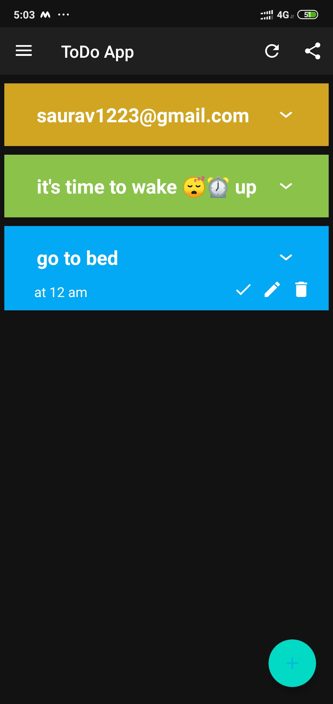
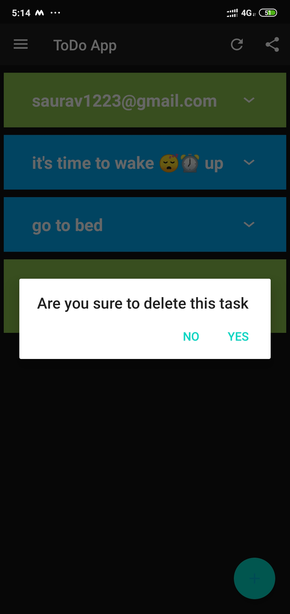

# ToDoApp With REST API

>In ToDO Application we use Rest Api as backend. This REST API is build in NodeJs,ExpressJs and Mongodb . IDE VISUAL STDIO CODE and the API tested on 

### REST API Link

>For Android Application Development we use IDE ANDROID STDIO and java.

## Features Of Application

&rarr; ToDo App handles your daily routine. some times you forgot to do your works.

&rarr; Our App is very concern about your precious time. 

&rarr; And this app will definitely help you todo your works on very right time.

### Firstly you have to login or register to our app with right email and password.

ToDo Register Page             |  ToDo Login Page
:-------------------------:|:-------------------------:
   | 

### Now we will add some task

ToDo App Navigation             |  Add Task todo          | Task Added todo
:-------------------------:|:-------------------------:|:-------------------------:
   |  | 

### some more Screenshot alike

ToDo Udate Task             |  Change to new todo          | Task Updated
:-------------------------:|:-------------------------:|:-------------------------:
   |  | 

 Deletion in progress             |  TODO Deleted
:-------------------------:|:-------------------------:
   | 

### Finished ToDo List

Move to Finished Task             |  Task is finished now
:-------------------------:|:-------------------------:
   | 

### This is how you can use our software

***
